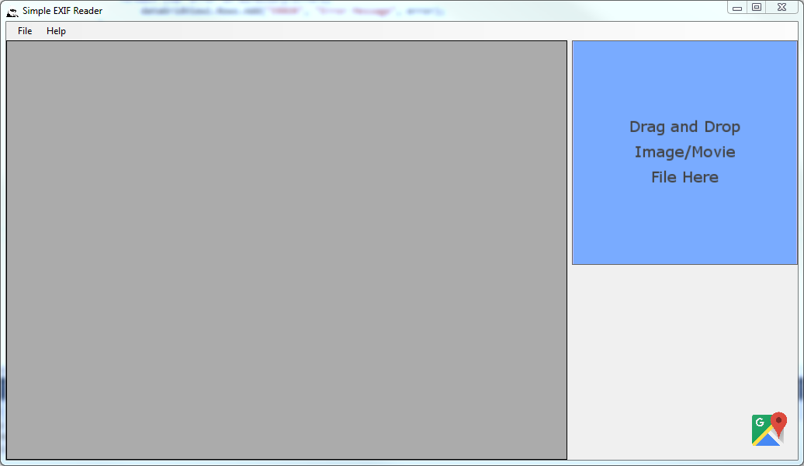
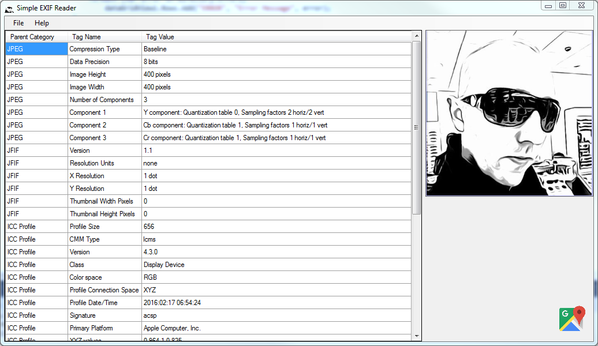

# Simple EXIF Reader

This is an image/movie metadata reader that provides a simplistic GUI interface to the [MetadataExtractor .NET library](https://github.com/drewnoakes/metadata-extractor-dotnet). 

## Simple User Interface

Default UI:

After opening image:

## Supported Metadata Forms

The following forms of metadata are supported:

 - EXIF
 - IPTC
 - XMP
 - JFIF
 - ICC Profiles
 - Photoshop
 - WebP
 - PNG
 - BMP
 - GIF
 - ICO
 - PCX

## Supported File Types

It will process files of type:

* JPEG
* TIFF
* WebP
* PSD
* PNG
* BMP
* GIF
* ICO
* PCX
* Camera Raw
  * NEF (Nikon)
  * CR2 (Canon)
  * ORF (Olympus)
  * ARW (Sony)
  * RW2 (Panasonic)
  * RWL (Leica)
  * SRW (Samsung)

Camera-specific "makernote" data is decoded for cameras manufactured by:

* Agfa
* Apple
* Canon
* Casio
* Epson
* Fujifilm
* Kodak
* Kyocera
* Leica
* Minolta
* Nikon
* Olympus
* Panasonic
* Pentax
* Sanyo
* Sigma/Foveon
* Sony

-------------------------------------

&copy; 2016 Dan O'Day (http://4n68r.com). Follow me on Twitter [@4n68r](http://twitter.com/4n68r)

You're welcome, Jerod ;)